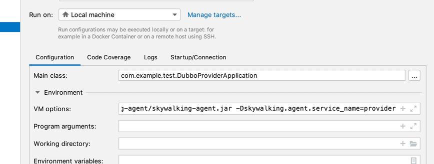

## skywalking 安装
[skywalking 安装地址](https://skywalking.apache.org/downloads/)

### 1、下载apm 安装包
* [apache-skywalking-apm-8.9.1.tar.gz](https://www.apache.org/dyn/closer.cgi/skywalking/8.9.1/apache-skywalking-apm-8.9.1.tar.gz)

### 2、启动服务端 oapService &  webappService

```bash 
cd apache-skywalking-apm-bin/bin

# startup.sh  会启动 oapService.sh & webappService.sh
bash startup.sh 
```
修改配置文件地址: apache-skywalking-apm-bin/config/application.yml
#### 修改webappService 端口
default webappService 界面服务 端口 8080 http://127.0.0.1:8080/trace 需要修改 /apache-skywalking-apm-bin/webapp/webapp.yml 可以进入就行修改

#### 修改oapService 存储
oapService 默认存储使用 SW_STORAGE:h2 ,如果使用mysql or other ，修改一下具体的配置项即可，mysql 会自动创建表结构哦，需要把jdbc的 apache-skywalking-apm-bin/oap-libs/mysql-connector-java-8.0.28.jar 放在这个目录哦。

### 3、客户端agent 设置

* 下载Java agent [apache-skywalking-java-agent-8.8.0.tgz](https://www.apache.org/dyn/closer.cgi/skywalking/java-agent/8.8.0/apache-skywalking-java-agent-8.8.0.tgz)

* 启动vm options 增加配置
  
  skywalking.agent.service_name=provider 为应用的名称

```bash
-javaagent:/Users/wangji/dev/skywalking-agent/skywalking-agent.jar -Dskywalking.agent.service_name=provider
```
 


* 启动 consumer & provider


## 访问

### 访问consumer 接口

```bash
ab -n 100 -c 10  http://127.0.0.1:8081/sayHello?name=123
```

### 查看trace(webappService) & 本地日志

#### 进入sky 管理界面

[http://127.0.0.1:8080/trace](http://127.0.0.1:8080/trace)

#### 查看客户端日志
[How To Print trace ID in your logs In Sky](https://skywalking.apache.org/docs/skywalking-java/v8.8.0/en/setup/service-agent/java-agent/application-toolkit-logback-1.x/)

这里处理 Logback tid，这种思路不错,更新layout,使用默认的，然后增加 ClassicConverter，非常简单方便,LogbackPatternConverter 里面获取是通过sky agent 增强返回的非常骚气，分离了实现和客户端代码,方便更新修复bug，减少依赖

```java
public class TraceIdPatternLogbackLayout extends PatternLayout {
    public TraceIdPatternLogbackLayout() {
    }

    static {
        defaultConverterMap.put("tid", LogbackPatternConverter.class.getName());
        defaultConverterMap.put("sw_ctx", LogbackSkyWalkingContextPatternConverter.class.getName());
    }
}
```

```xml
 <appender name="CONSOLE" class="ch.qos.logback.core.ConsoleAppender">
        <encoder class="ch.qos.logback.core.encoder.LayoutWrappingEncoder">
            <layout class="org.apache.skywalking.apm.toolkit.log.logback.v1.x.TraceIdPatternLogbackLayout">
                <Pattern>%d{yyyy-MM-dd HH:mm:ss.SSS} [%tid] [%thread] %-5level %logger{36} -%msg%n</Pattern>
            </layout>
            <charset>utf8</charset>
        </encoder>
    </appender>
```

```xml
2022-01-25 19:17:01.735 [TID:de98a5b85f5e476ba249ed66edc06bd0.73.16431094211580001] [DubboServerHandler-30.11.176.38:12345-thread-2] INFO  c.e.test.provider.DemoServiceImpl -[19:17:01] Hello 13446555, request from consumer: /30.11.176.38:62365
2022-01-25 19:17:07.009 [TID:de98a5b85f5e476ba249ed66edc06bd0.75.16431094270040001] [DubboServerHandler-30.11.176.38:12345-thread-3] INFO  c.e.test.provider.DemoServiceImpl -[19:17:07] Hello 123, request from consumer: /30.11.176.38:62365
```

# 关于skywalking 采样率的探究

## Trace Sampling at server side （服务端采样率）

[https://skywalking.apache.org/docs/main/latest/en/setup/backend/trace-sampling/](https://skywalking.apache.org/docs/main/latest/en/setup/backend/trace-sampling/)

默认为 100% ,这里修改为10%
> 注意这里不同的版本配置地方不一样，有的在application.yml,新版本都在8.8以上 trace-sampling-policy-settings.yml

配置文件地址： apache-skywalking-apm-bin/config/trace-sampling-policy-settings.yml 

1000 = 10% ,也可以设置为0 服务端不进行采样，不存储


```xml
default:
  # Default sampling rate that replaces the 'agent-analyzer.default.sampleRate'
  # The sample rate precision is 1/10000. 10000 means 100% sample in default.
  rate: 1000
  # Default trace latency time that replaces the 'agent-analyzer.default.slowTraceSegmentThreshold'
  # Setting this threshold about the latency would make the slow trace segments sampled if they cost more time, even the sampling mechanism activated. The default value is `-1`, which means would not sample slow traces. Unit, millisecond.
  duration: -1
#services:
#  - name: serverName
#    rate: 1000 # Sampling rate of this specific service
#    duration: 10000 # Trace latency threshold for trace sampling for this specific service
```

### 并发访问1000次

```bash
ab -n 1000 -c 200  http://127.0.0.1:8081/sayHello\?name\=13446555
```
#### idea 所有日志


#### sky 管理界面搜索不到部分
* 搜索不到  15c4638aa8254352b86838f41263c645.205.16430933407250007


  
* 搜索到了 15c4638aa8254352b86838f41263c645.202.16430933407260007


证明了一个问题，服务端的采样有效了...  分页只有 14 页 1000的访问数据,这样也侧面证明了客户端tid 正常打印，服务端也没有存储所有的日志，
极大的减少了占用大量存储空间，如果是需要日志里面打印traceId，sky 界面不需要搜索这样可以将rate 设置为0。


## 客户端采样
3 秒采样1个，默认配置为-1 就是不进行客户端采样过滤，全部都发送到服务端

The number of sampled traces per 3 seconds, Negative or zero means off, by default  
agent.sample_n_per_3_secs=${SW_AGENT_SAMPLE:1}

[https://skywalking.apache.org/docs/skywalking-java/latest/en/setup/service-agent/java-agent/configurations/](https://skywalking.apache.org/docs/skywalking-java/latest/en/setup/service-agent/java-agent/configurations/)

TID:Ignored_Trace 意味着被拒绝采样了..，日志里面打印的traceId 都被吃掉了，这个不是我们想要的效果，客户端的日志都需要出现traceId


## 需求

* 需求是不需要将所有的采样都进行存储,分布式跟踪系统的一个优点是可以从跟踪中获得详细的信息。但是，缺点是这些跟踪会占用大量存储空间。但是客户端的log日志里面可以搜索到 日志的traceId 进行串联起来，这样客户端的就不进行过滤，服务端过滤即可。有点类似tlog的功能 [https://tlog.yomahub.com/](https://tlog.yomahub.com/)

* 这里客户端的日志需要配置logback layout [application-toolkit-logback-1.x/](https://skywalking.apache.org/docs/skywalking-java/latest/en/setup/service-agent/java-agent/application-toolkit-logback-1.x/) 即可享受traceId 的秘密

#  skywalking 跨线程处理探究

* 官方文档链接 [trace cross thread link](https://skywalking.apache.org/docs/skywalking-java/latest/en/setup/service-agent/java-agent/application-toolkit-trace-cross-thread/)

### 不进行扩线程处理效果
```java
 /**
   * 没有包装 CallableWrapper.of 不生效，跨线程失败
   * 
   * @param name
   * @return
   * @throws ExecutionException
   * @throws InterruptedException
   */
  @ResponseBody
  @GetMapping("/sayHelloNotAcrossThread")
  public String sayHelloNotAcrossThread(@RequestParam(required = false, defaultValue = "hello name") String name) throws ExecutionException,
                                                                                                                  InterruptedException {
      log.info("get url{}", httpServletRequest.getRequestURI());

      final Future<String> submit = executorService.submit(new Callable<String>() {

          @Override
          public String call() throws Exception {
              return demoService.sayHello(name);
          }
      });
      return submit.get();
  }
```
效果图如下: 调用追踪不连续了，dubbo 独立追踪了，为两个trace


### TraceCrossThread 处理

```java
@ResponseBody
@GetMapping("/sayHelloAcrossThread")
public String sayHelloAcrossThread(@RequestParam(required = false, defaultValue = "hello name") String name) throws ExecutionException,
                                                                                                             InterruptedException {
    log.info("get url{}", httpServletRequest.getRequestURI());

    final Future<String> submit = executorService.submit(CallableWrapper.of(new Callable<String>() {
        // CallableWrapper 本质是重新构造一个CallableWrapper对象，CallableWrapper类上有@TraceCrossThread 注解
        @Override
        public String call() throws Exception {
            return demoService.sayHello(name);
        }
    }));
    return submit.get();
}

```
效果图如下，调用连续了


### @TraceCrossThread 注解

```java
@TraceCrossThread
public class CallableWrapper<V> implements Callable<V> {
  final Callable<V> callable;

  public static <V> CallableWrapper<V> of(Callable<V> r) {
    return new CallableWrapper(r);
  }

  public CallableWrapper(Callable<V> callable) {
    this.callable = callable;
  }

  public V call() throws Exception {
    return this.callable.call();
  }
}
```

* @TraceCrossThread 处理非常的骚气，被标注的class 在构造函数中会进行 trace 信息的复制,注意这里一定是构造函数
本质是处理 构造函数包装的时候会重新构造一个 CallableWrapper, 官方的 [Bootstrap class plugins agent](https://skywalking.apache.org/docs/skywalking-java/latest/en/setup/service-agent/java-agent/bootstrap-plugins/) Plugin of JDK Callable and Runnable. Agent is compatible with JDK 1.8+ 会处理 标注了 @TraceCrossThread 的新的构造进行追踪哦。

* CallableOrRunnableActivation：presents that skywalking intercepts all Class with annotation "org.skywalking.apm.toolkit.trace.TraceCrossThread" and method named "call" or "run". 源码: org.apache.skywalking.apm.toolkit.activation.trace.CallableOrRunnableActivation  org.apache.skywalking.apm.plugin.jdk.threading.define.CallableInstrumentation。 本质还是字节码增强，针对指定的构造函数、方法、且类注解去处理。 [skywalking 异步线程链路源码讲解，这篇文章不错](https://blog.csdn.net/a17816876003/article/details/121444516)
  更多参考插件开发文档[https://skywalking.apache.org/docs/skywalking-java/latest/en/setup/service-agent/java-agent/java-plugin-development-guide/#abstract](https://skywalking.apache.org/docs/skywalking-java/latest/en/setup/service-agent/java-agent/java-plugin-development-guide/#abstract)

* [跨线程问题解决使用篇](https://blog.csdn.net/kingtok/article/details/113987328)
手动增加标签
```xml
@GetMapping("/task")
@ResponseBody
public String task() throws Exception {
  ActiveSpan.tag("type", "sayHello");
  log.info("come in : /task");
  // 自定义操作名称。
  ActiveSpan.setOperationName("测试任务SayHello Task");
  // 在当前范围内添加信息级别日志消息。
  ActiveSpan.info("这个是一个日志信息");
  ActiveSpan.tag("testTag","sayHello");
  return demoService.sayHello("sayHello");
}

```
手动标记 增加日志、操作等等信息


